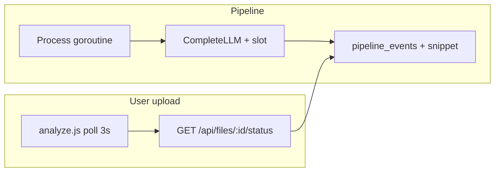

# Learn from example — financial-statements → jump-starter

**Status:** Implemented (PRs 1–3 merged in jump-starter)  
**Source sprout:** `/Users/lironliptz/work/projects/roligo/brosh/finanacial-statements`  
**Template:** jump-starter (this repo)  
**Prompt:** `prompts/dev/prompt_learn_from_example.txt`  
**Last reviewed:** 2026-05-25

This document is the **approved-style porting plan** produced by running the learn-from-example brief. Use it to scope PRs; do not copy domain logic from the sprout.

---

## A. Executive summary

| Priority | Item | Effort | Why |
|----------|------|--------|-----|
| 1 | **LLM concurrency gate + audit** (`CompleteLLM`, slot limit, structured events) | **M** | Prevents provider stampede; adds observability every sprout needs |
| 2 | **Richer `/api/files/:id/status`** (stage %, error detail, LLM timing/info) | **M** | Better UX without websockets; builds on existing `pipeline_events` |
| 3 | **Per-route HTTP timeouts** (not global 60s on all routes) | **S** | Unblocks long admin/sync routes sprouts add later |
| 4 | **Progress bar UI primitives** (`createLLMProgressBar` in `app.js` + CSS) | **S** | Cosmetic until API sends `pipeline_progress`; quick win after #2 |
| 5 | **Cancellable pipeline runs** | **M** | Recovery from stuck `llm_pending` after restarts |
| 6 | **`projects.file_size`** on upload list | **S** | Small schema + handler change |

**Not worth porting for parity:** Main upload page (`analyze.js` / `/api/files`) is already aligned with the sprout (3s polling, spinner, `llm_model`, `completed_at`, processing time). Rich file metadata in the sprout lives on a **parallel** `company_files` track — not on standard uploads.

**Defer:** MAYA scrape job tables, company pages, finanalytics, PDF compact pipeline, websockets/SSE, full sprout test suite (39 files).

---

## B. Gap matrix

| Feature | Sprout location | jump-starter today | Verdict | Notes |
|---------|-----------------|-------------------|---------|-------|
| Upload list polling + elapsed time | `static/js/analyze.js` | Same pattern | **Stay** | Already synced |
| Stage → % progress mapping | `pipelineStatusPct()` in `internal/handlers/maya_scrape.go` | Absent | **Port** | Generic stage weights |
| `<progress>` UI + simulated LLM bar | `static/js/app.js` (`createLLMProgressBar`), `static/css/style.css`, `company-page.js` | Spinner only in `analyze.js` | **Port** | Wire to status API |
| Scrape/job countable progress | `internal/db/maya_scrape_jobs.go`, `mayascrape` callbacks | No job table | **Hook** | Pattern for crawlers; tables stay in sprouts |
| In-memory FIFO job queue | `maya_scrape_queue.go` | None | **Hook** | Optional `internal/workqueue` |
| Background poll worker | `company_file_worker.go` | `go pipeline.Process` on upload only | **Hook** | For disk/crawler-ingested files |
| LLM concurrency gate | `internal/pipeline/llm_gate.go` → `CompleteLLM()` | Direct `LLM.Complete()` in `pipeline.go` | **Port** | High value |
| LLM audit metadata | `llm.RequestLog`, `file_events.result_snippet` | `pipeline_events`: stage + message only | **Port** | Extend events or add columns |
| LLM timing / info in API | `LLMTimingsForFiles`, `attachLLMTimingFields` | Not on `/api/files` | **Port** | Map to `project_id` + events |
| Rich row fields (`file_size`, `error_detail`) | `company_files` table | `projects` lacks these | **Port** | Small migration |
| Pipeline cancel | `company_file_cancel.go`, `CancelCompanyFileProcessing` | No cancel | **Port** | `POST /api/files/:id/cancel` |
| Stuck-run detection UX | `isStuckCompanyFile()` in `company-page.js` | None | **Defer** | After cancel + `updated_at` |
| Error toast | `showError()` in `app.js` | Same | **Stay** | |
| Inline error in table | `company-page.js` | Badge only | **Port** | After API exposes `error_detail` |
| Websockets / SSE | None | None | **Stay** | Polling is the pattern |
| HTTP timeouts | Per-route groups in sprout `router.go` | Global 60s middleware | **Port** | |
| `LLM_REQUEST_TIMEOUT` env | `effectiveLLMRequestTimeout()` | Not in `.env.example` | **Port** | |
| Admin tabs | `admin.html`, `internal/admin/` | Same (+ crawler stats) | **Stay** | Branding/RTL only |
| Core DB v1–8 | Same migrations through `crawler_run_stats` | Same | **Stay** | |
| `file_events` / `company_files` | Sprout migrations v31+ | Absent | **Defer** | Domain-shaped |
| `maya_scrape_jobs` | Sprout v12–15 | Absent | **Defer** | Domain job tracking |
| Progress CSS | `style.css` ~904–1060 | No progress-bar block | **Port** | Generic subset |
| Env: `MAX_CONCURRENT_LLM` | Sprout `.env.example` | Missing | **Port** | |
| Docker | Same layout, `./.db/` volume | Same | **Stay** | |
| Tests (39 vs 5 files) | Domain-heavy | Minimal | **Defer** | Port per feature |
| Prompt audit helper | `SelectPromptSelection()` in `prompt_meta.go` | `SelectPrompt()` string only | **Port** | Feeds LLM audit |
| PDF validate/compact | `fileconv/validate.go`, `pdf_compact*` | Absent | **Defer** | Separate PR |
| Crawler progress hooks | `mayascrape.ProgressCallbacks` | No callbacks on shared flows | **Hook** | Optional in `internal/crawler` |

### Seed hypotheses — verdict

| Hypothesis | Verdict |
|------------|---------|
| **Progress bars + backend for long processes** | **Partially confirmed.** Stage weights, scrape counters, and LLM gate exist in sprout; **standard upload UI** does not use them yet — they power `company-page.js` and MAYA scrape polling. |
| **Richer uploaded file info** | **Confirmed for company files, not for `/api/files`.** Size, `llm_info`, `pipeline_progress`, `error_detail` are on `/api/company/files*`; the template upload list is still ID / name / model / status / time. |

---

## C. Detailed recommendations (Port)

### C1. LLM concurrency gate + audit

**Problem:** Unlimited parallel `go pipeline.Process` can stampede the LLM provider; no structured record of model, prompt size, queue wait, or response stats.

**Sprout reference:**
- `internal/pipeline/llm_gate.go` — `acquireLLMSlot`, `releaseLLMSlot`, `Run.CompleteLLM()`
- `internal/pipeline/pipeline.go` — `defaultProcess` uses `CompleteLLM`
- `internal/llm/client.go` — `RequestLog`, `RequestBlob`

**Template design:**
- Add `internal/pipeline/llm_gate.go` (same semantics as sprout).
- Migration **v9:** optional `pipeline_events.outcome`, `pipeline_events.result_snippet` (JSON for LLM metadata).
- `Run.logLLMDB()` writing `llm_request` / `llm_call`-style stages (mirror sprout `file_events` naming in messages).
- Env: `MAX_CONCURRENT_LLM` (default e.g. `2`).

**Implementation checklist:**
1. `internal/llm/client.go` — `RequestLog` (+ `RequestBlob` if needed later).
2. `internal/pipeline/llm_gate.go` + wire `defaultProcess` → `run.CompleteLLM`.
3. `internal/pipeline/prompt_meta.go` — `SelectPromptSelection()` (generic default branch).
4. `internal/db/db.go` — migration v9 + `AddEventEx(...)`.
5. `.env.example`, `AGENTS.md` pitfall note.

**Risks:** Old rows lack snippets — UI must tolerate empty metadata.

---

### C2. Richer `/api/files/:id/status` + upload UI progress

**Problem:** Users see stage name + elapsed time but not weighted progress, LLM duration, or error text.

**Sprout reference:**
- `pipelineStatusPct()` / `pipelineStatusLabel()` — `internal/handlers/maya_scrape.go`
- `attachLLMTimingFields` — `internal/handlers/company_file_period.go`
- UI: `company-page.js`, `createLLMProgressBar()` in sprout `static/js/app.js`
- CSS: `static/css/style.css` (progress block)

**Template design — extend `GET /api/files/:id/status`:**
```json
{
  "status": "llm_pending",
  "completed_at": "",
  "pipeline_progress": 55,
  "pipeline_status_label": "Analyzing document",
  "llm_in_progress": true,
  "llm_duration_sec": 12,
  "llm_info": { "model": "...", "prompt_chars": 0 },
  "error_detail": ""
}
```

**Implementation checklist:**
1. `internal/handlers/pipeline_status.go` — `PipelineStatusPct`, `PipelineStatusLabel` (generic stages).
2. `internal/db/db.go` — `LLMTimingForProject`, `LLMInfoForProject` from `pipeline_events`.
3. `internal/handlers/files.go` — `FileHandler.Status` enrichment.
4. `static/js/app.js` — port `createLLMProgressBar`, `makePipelineSpinner` (English labels).
5. `static/css/style.css` — `.pipeline-progress-bar` (rename from sprout-specific classes).
6. `static/js/analyze.js` — `updateRow()` renders bar when `pipeline_progress` present.

**Risks:** Rich `llm_info` depends on C1 event snippets; ship progress % + `error_detail` first.

---

### C3. Cancellable pipeline runs

**Problem:** Stuck `llm_pending` after restart; no user recovery.

**Sprout reference:** `company_file_cancel.go`, `CancelCompanyFileProcessing`, `POST .../cancel`.

**Template design:**
- `Pipeline`: `projectBusy sync.Map`, `projectCancels sync.Map`.
- Wrap `Process()` with cancellable context.
- `POST /api/files/:id/cancel` → cancel context, status `error`, event message `cancelled`.

**Implementation checklist:**
1. `internal/pipeline/cancel.go` (adapt from sprout).
2. `internal/handlers/files.go` + `router.go` registration.
3. Test: cancel during `llm_pending` sets terminal state.

**Risks:** In-flight LLM request may run until provider timeout — acceptable v1.

---

### C4. Per-route HTTP timeouts

**Problem:** Global `requestTimeout(60s)` on all routes breaks long LLM/admin routes.

**Sprout reference:** `internal/handlers/router.go` — per-group timeouts, `LLM_REQUEST_TIMEOUT`.

**Template design:**
- Remove global timeout middleware.
- `requestTimeout(60s)` on auth, files, admin groups.
- Document `LLM_REQUEST_TIMEOUT` (default `10m`) for future LLM sync group.

**Implementation checklist:** Refactor `NewRouter`; `.env.example`.

**Risks:** Low — pipeline uses detached background context.

---

### C5. Project metadata (`file_size`)

**Problem:** File list has no size; errors only in event history.

**Template design:** Migration **v10:** `projects.file_size INTEGER DEFAULT 0`. Set in upload handler from `multipart.FileHeader.Size`. Optional column in `index.html`.

---

### C6. Shared progress UI primitives

**Problem:** jump-starter `app.js` lacks reusable progress helpers sprout added (~95 lines).

**Template design:** Port helpers with generic class names; simulated bar during `llm_pending` until API sends real `pipeline_progress`.

---

## D. Out of scope (stay in sprout)

- `internal/finanalytics/`, `internal/insights/`, similar-companies flows
- `internal/companyinfo/`, TASE / public company tables, registry search
- Company pages: `static/company*.html`, `company-page.js`, reports UI
- `company_files`, `file_events`, `maya_scrape_jobs` tables and `/api/company/*`
- `internal/mayascrape/` (except documenting `ProgressCallbacks` as optional hook)
- Financial extraction prompts, `financial_process.go`, PDF compact pipeline
- Hebrew RTL copy, sprout branding, Jump-Start slug defaults
- Bulk port of 39 sprout test files

---

## E. Suggested PR sequence

### PR 1 — Pipeline LLM gate + status API + router timeouts *(done)*

### PR 2 — Upload UX *(done)*

### PR 3 — Hooks for sprouts *(done)*

- `internal/workqueue/` — generic FIFO queue
- `internal/crawler/progress.go` + hooks in `session.go`
- `internal/pipeline/queue.go` — `InitQueue`, `EnqueueProcess`, `IngestFromDisk`

---

## F. How to use this doc

| Action | Command / path |
|--------|----------------|
| Re-run analysis on another sprout | Edit path in `prompts/dev/prompt_learn_from_example.txt`, save output as `docs/learn-from-<slug>.md` |
| Implement PR 1 | `Implement PR 1 from docs/learn-from-financial-statements.md` |
| Verify upload flow | `.claude/skills/test-pipeline/SKILL.md` |
| After schema change | `.claude/skills/add-db-table/SKILL.md` |

Update this file when a PR lands (check off items, bump **Status**).

---

## G. Architecture sketch (target state)



**Principle:** Extend `pipeline_events` and status JSON before adding new domain tables (`company_files`-style).
